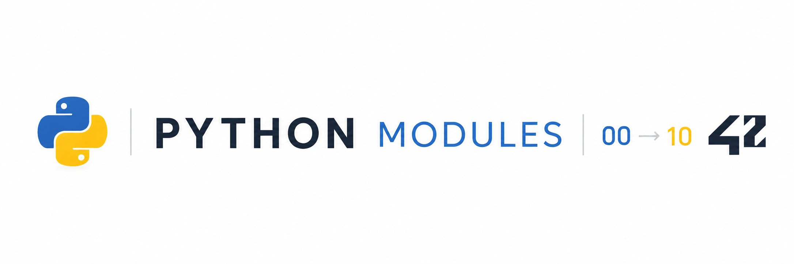

*This project has been created as part of the 42 curriculum by vslyunko*

<p align="center">
  
</p>

<p align="center">
  
  
  
  
  
  
  
  
</p>

---
## Overview

This repository brings together my Python learning path at **42 Málaga**, organized across **11 progressive modules (00–10)**.

Rather than focusing on one application, the modules build Python knowledge step by step: starting with syntax and program structure, then moving through object-oriented and functional programming, data structures, file handling, imports, design patterns, development environments, and data validation.

---
## Skills Practiced

`Python 3` · `OOP` · `Functional Programming` · `Type Hints` · `mypy` · `flake8` · `Exception Handling` · `Collections` · `Generators` · `File I/O` · `Design Patterns` · `Package Management` · `Virtual Environments` · `Pydantic`

---
## Learning Path
| Module | Focus | Key concepts |
| :---: | --- | --- |
| **00** | Python Fundamentals | Functions · Variables · Control flow · Loops · Recursion · Type hints |
| **01** | Object-Oriented Programming | Classes · Encapsulation · Inheritance · `super()` · Class & static methods |
| **02** | Exception Handling | `try/except` · Built-in exceptions · Custom exceptions · `raise` · `finally` |
| **03** | Collections & Data Structures | Lists · Tuples · Sets · Dictionaries · Generators · Comprehensions |
| **04** | File Handling & I/O | File I/O · `stdin/stdout/stderr` · Context managers · Error handling |
| **05** | Advanced OOP & Abstraction | Abstract classes · Polymorphism · Method overriding · Protocols · Duck typing |
| **06** | Modules & Packages | Imports · Packages · `__init__.py` · Relative/absolute imports · Circular dependencies |
| **07** | Design Patterns | Abstract Factory · Strategy · Interfaces · Composition · Dependency injection |
| **08** | Python Environments | Virtual environments · pip · Poetry · Dependencies · Environment variables |
| **09** | Data Validation | Pydantic 2 · Models · Field validation · Nested models · Typed data |
| **10** | Functional Programming | Lambdas · Higher-order functions · Closures · `functools` · Decorators |

---
## Repository Structure

```text
python-modules/
├── python00/
├── python01/
├── python02/
├── python03/
├── python04/
├── python05/
├── python06/
├── python07/
├── python08/
├── python09/
└── python10/
```

Each directory contains the exercises and implementations for one stage of the learning path.

## About 42

These modules were completed at **42 Málaga**, as part of the 42 curriculum's project-based and peer-learning approach.

---

**Viktoria Slyunko** · 42 Málaga
