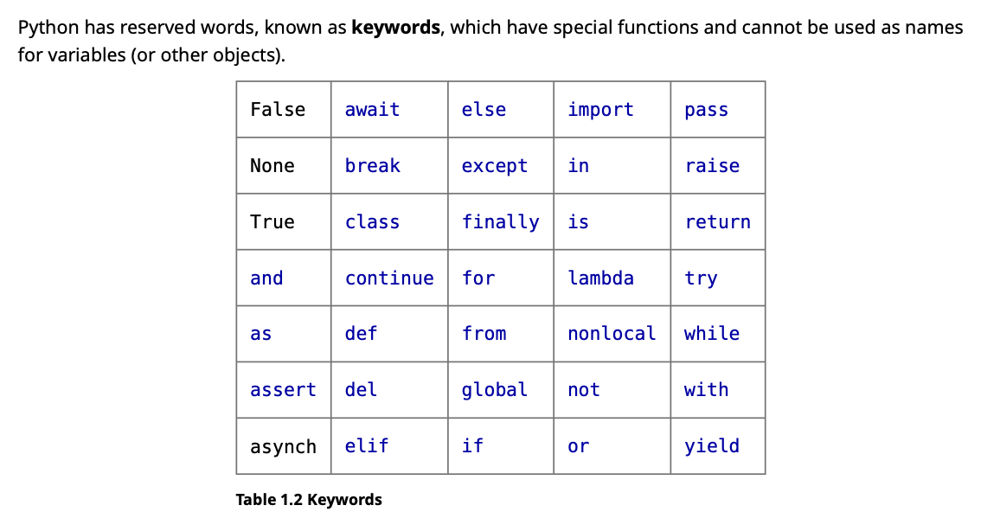

error hangling:
https://blog.miguelgrinberg.com/post/the-ultimate-guide-to-error-handling-in-python

An extremely useful command is help(), which enters a help functionality to
explore all the stuff python lets you do, right from the interpreter.

1.3 • Variables 15
